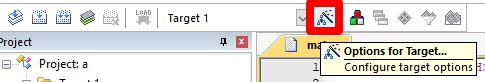
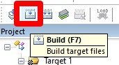
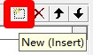

# 51单片机

## 软件安装

### 安装驱动

1. 解压`CH341SER.zip`
2. 双击`SETUP.EXE`进行安装

### 安装Keil5 C51

1. 下载并安装`Keil5 C51`
2. 管理员身份打开软件，点击`File`->`License Management`，复制右侧`Computer ID`->`CID`
3. 打开激活软件，粘贴到`CID`里面，点击`Generate`，复制生成的激活码
4. 粘贴到`License Management`里面的`New License ID Code(LIC)`，点击`Add LIC`，再点击`Close`
5. 激活完成

### 安装STC-ISP STC烧录软件

1. 下载地址：<http://stcmcudata.com/>
2. 找到右侧`STC-ISP下载编程烧录软件`
3. 下载第一个软件`STC-ISP软件V6.92K版`

## 软件使用

### 使用Keil5 C51

#### 创建项目

1. 点击`Project`->`New uVision Project`，选择一个文件夹，并输入文件名，点击`保存`
2. 在`Search`里面输入`at89c52`，选择`Atmel`里面的`AT89C52`，点击`OK`
3. 弹出提示选择`否`
4. 展开`Target 1`，在`Source Group 1`右键，选择`Add New Item to Group 'Source Group 1'`
5. 选择`C File(.c)`，`Name`处输入`main`，再点击`Add`
6. 文档空白处右键，选择`Insert '#include <REGX52.H>'`
7. 输入代码

```cpp
#include <REGX52.H>
void main()
{
  P2 = 0xFE;
  while (1)
  {
  }
}
```

8. 点击图片所示按钮，选择`Output`，勾选`Create HEX File`，点击`OK`
9. 点击图片所示按钮
10. 构建完成

#### 创建工作空间

1. 点击`Project`->`New Multi-Project Workspace`，选择一个文件夹，并输入文件名，点击`保存`
2. 点击图片所示按钮，选择项目路径，点击`OK`
3. 项目右键`Set as Active Project`，再构建项目

#### 工作空间导入新项目

1. 右键`Workspace`目录，点击`Manage Multi-Project Workspace`

#### 导入项目/工作空间

1. 点击`Project`->`Open Project`，选择项目/工作空间，点击`打开`

### 使用VS Code插件Keil Assistant

1. 拓展搜索`Keil Assistant`并安装
2. 拓展设置：修改`Uv4 Path`为安装路径
3. 左下角找到`KEIL UVISION PROJECT`
4. 点击右侧`+`号导入项目
5. 点击`Target 1`右侧第一个`Build (F7)`编译项目

### 使用STC-ISP STC烧录软件

1. 点击`芯片型号右侧的下拉框`，找到`STC89C52RC 系列`，选择`STC89C52RC/LE52RC`
2. 点击`打开程序文件`，选择项目路径下的`Objects`文件夹，选择`.hex`文件，点击`打开`
3. 点击`下载/编程`
4. 重启单片机
5. 烧录完成
