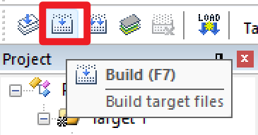

# STM32单片机

## 安装以及激活`Keil5 MDK`

1. 下载并安装`Keil5 MDK`
2. 双击`Keil.STM32F1xx_DFP.2.2.0.pack`，安装支持包
3. 管理员身份打开软件，点击`File`->`License Management`，复制右侧`Computer ID`->`CID`
4. 打开激活软件，`Target`选择`ARM`，粘贴到`CID`里面，点击`Generate`，复制生成的激活码
5. 粘贴到`License Management`里面的`New License ID Code(LIC)`，点击`Add LIC`，再点击`Close`
6. 激活完成

## 安装`STLink`驱动

1. 打开`Keil5 MDK`安装文件夹，进入`ARM/STLink/USBDriver`，双击`dpinst_amd64.exe`安装
2. 进入`ARM\STLink`，连接`STLink`，双击`ST-LinkUpgrade.exe`进行更新

## 使用`Keil5 MDK`

### 创建基于`寄存器`的项目

1. 点击`Project`->`New uVision Project`，选择一个文件夹，并输入文件名，点击`保存`
2. 在`Search`里面输入`stm32f103c8`，选择`STMicroelectronics`里面的`STM32F103C8`，点击`OK`
3. 弹出提示选择`否`
4. 打开工程库文件夹`STM32F10x_StdPeriph_Lib_V3.5.0`
5. 进入`Libraries\CMSIS\CM3\DeviceSupport\ST\STM32F10x\startup\arm`文件夹(启动文件)
6. 在项目根目录新建`Start`文件夹(启动文件夹)，把`startup_stm32f10x_md.s`文件复制到该文件夹内
7. 进入`Libraries\CMSIS\CM3\DeviceSupport\ST\STM32F10x`文件夹
8. 复制`stm32f10x.h`(外设寄存器描述文件)、`system_stm32f10x.c`(时钟描述文件)、`system_stm32f10x.h`(时钟配置函数)到`Start`文件夹
9. 进入`Libraries\CMSIS\CM3\CoreSupport`文件夹
10. 复制`core_cm3.c`(内核寄存器配置函数)、`core_cm3.h`(内核寄存器描述文件)到`Start`文件夹
11. 展开`Target 1`，点击2次`Source Group 1`，改名为`Start`，右键，选择`Add Existing Files to Group 'Start'`
12. 文件选择`All files(*.*)`，把所有文件都选中，再点击`Add`
13. 添加头文件路径：点击图片所示按钮，选择`C/C++`、选择`Include Paths`，点击右边`...`按钮，点击`New`按钮，输入`.\Start`，点击`OK`
14. 选择`Debug`，`Use`选择`ST-Link Debugger`(使用STLink调试器)，选择`Settings`、选择`Flash Download`，勾选`Reset and Run`(下载程序后，立即复位并执行程序)
15. 在项目根目录新建`Main`文件夹(用户代码文件夹)
16. `Target 1`右键选择`Add Group`，改名为`Main`
17. `Main`右键选择`Add New Item to Group 'Main'`
18. 选择`C File(.c)`，`Name`处输入`main`，`Location`选择到`Main`文件夹，再点击`Add`
19. 文档空白处右键，选择`Insert '#include file'`，选择`stm32f10x.h`
20. 输入代码

```c
#include "stm32f10x.h"
int main()
{
  RCC->APB2ENR = 0x00000010;
  GPIOC->CRH = 0x00300000;
  // PC13亮
  GPIOC->ODR = 0x00000000;
  // PC13灭
  // GPIOC->ODR = 0x00002000;
  while (1)
  {
  }
}
```

21. 点击图片所示按钮
22. 接好单片机并插上`STLink`，默认程序红灯电源常量，蓝灯PC13闪烁，接线方式见<https://jiangxiekeji.com/problem/p1-2.html>(STLink 2468 [SWCLK SWDIO GND 3.3V] 蓝紫灰白 灰蓝紫白 [GND SWCLK SWIO 3V3] STM32)
23. 点击图片所示按钮
24. 蓝灯PC13常亮

### 创建基于`库函数`的项目

1. 在`寄存器`的基础上
2. 在项目根目录新建`Lib`文件夹(库函数文件夹)
3. `Target 1`右键选择`Add Group`，改名为`Lib`
4. 进入`Libraries\STM32F10x_StdPeriph_Driver\src`文件夹
5. 复制全部文件到`Lib`文件夹，其中`misc.c`(混杂)是内核库函数，其他是外设库函数
6. 进入`Libraries\STM32F10x_StdPeriph_Driver\inc`文件夹(库函数头文件)，复制全部文件到`Lib`文件夹，并添加到`Keil`
7. 进入`Project\STM32F10x_StdPeriph_Template`文件夹
8. 复制`stm32f10x_conf.h`(配置库函数头文件的包含关系、用来参数检查的函数定义)、`stm32f10x_it.c`(中断函数)、`stm32f10x_it.h`(中断函数头文件)到`Main`文件夹，并添加到`Keil`
9. 打开文件`Start/stm32f10x.h`，拉到最后，可以看到`#ifdef USE_STDPERIPH_DRIVER`，意思是：如果定义了`使用标准外设驱动`，`#include "stm32f10x_conf.h"`这个语句才有效，复制字符串`USE_STDPERIPH_DRIVER`
10. 打开`选项`、`C/C++`、`Define`粘贴字符串`USE_STDPERIPH_DRIVER`
11. `Include Paths`再加上`.\Lib`和`.\Main`，或者直接输入`.\Start;.\Lib;.\Main`
12. `选项`右侧按钮`File Extensions, Books and Environment`，更改显示顺序，把`.\Main`移动到最后
13. 在`main.c`文件中输入代码

```c
#include "stm32f10x.h"
int main()
{
  RCC_APB2PeriphClockCmd(RCC_APB2Periph_GPIOC, ENABLE);
  GPIO_InitTypeDef GPIO_InitStructure;
  GPIO_InitStructure.GPIO_Mode = GPIO_Mode_Out_PP;
  GPIO_InitStructure.GPIO_Pin = GPIO_Pin_13;
  GPIO_InitStructure.GPIO_Speed = GPIO_Speed_50MHz;
  GPIO_Init(GPIOC, &GPIO_InitStructure);
  // PC13亮
  GPIO_ResetBits(GPIOC, GPIO_Pin_13);
  // PC13灭
  // GPIO_SetBits(GPIOC, GPIO_Pin_13);
  while (1)
  {
  }
}
```

14. 构建、下载
15. 蓝灯PC13常亮

## 使用`VS Code`插件`Keil Assistant`

1. 拓展搜索`Keil Assistant`并安装
2. 拓展设置：修改`Uv4 Path`为安装路径
3. 左下角找到`KEIL UVISION PROJECT`
4. 点击右侧`+`号导入项目
5. 点击`Target 1`右侧第一个`Build (F7)`编译项目
6. 点击第二个`Download To Device (Ctrl+Alt+D)`下载到设备
